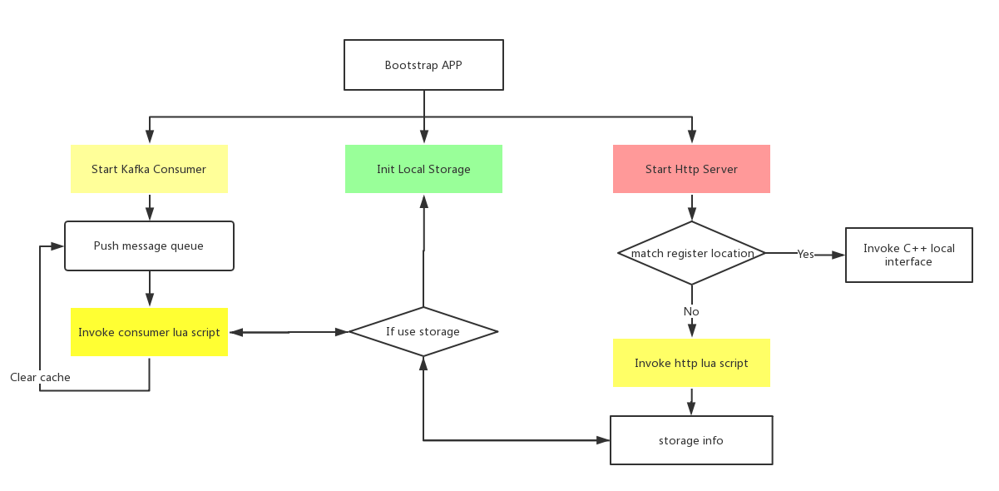

# AIDP (Data Process)

[中文文档](README_CN.md)

AIDP is responsible for a series of messages such as message queue consumption. After getting the message, the specific processing is handled by Lua script. The developer can customize the processing of the consumption queue, and the framework provides http server service. You can use the Lua script to customize the http API Interface, and then consumption message logic and http server between the framework provides a simple Key-Val storage structure for data sharing. The figure is the structure of the AIDP data processing framework:


AIDP invoke flow：



### Why use lua script customize ? 

Most of the application scenarios for the message queue are back-end with a consumer module for data processing, the final data stored in a DB, and finally through the RPC interface for the user use. Some application scenarios data process logic may be particularly simple, but most of the language is very complicated for Kafka's consumption (Kafka consumption logic) When the specific data process logic to increase the development costs, AIDP through C++ this general development model abstract package, in order to increase the custom through the embedded Lua scripting language. To complete the custom part of the logic. AIDP is a compromise between development difficulty, cost and flexibility. Can meet a large number of data processing demand 

### Quick Start

#### RPM install

RPM 目前支持 centos7.x 版本，其他版本陆续会上传, 有其他系统版本的需求可以提 issue

#### Complie install

First, install AIDP depend package adbase, Installation method refer : https://nmred.gitbooks.io/adbase/content/en/basic/install.html

Second, complie and install aidp

```
git clone git@github.com:weiboad/aidp.git
cd aidp
./cmake.sh
cd build
make
make install
```

#### Example

For example, using aidp get kafka cluster topic `test` data write to the local disk, and statistics the number of messages, the final number of messages through the http api interface can be obtained. In the installed aidp directory modify the configuration `conf/system.ini`, configure kafka consumption calls lua script path, by modifying `consumer` section `scriptName` field. Set up on the lua script can be configured to handle the script as follows:

```lua
--
--
-- This sctipt process message write to the local disk and statistics the number of messages store in local storage
--
--
local obj = aidp.message.get()
local filename = os.date('%Y-%m-%d-%H') .. '.log'
local files = {};
-- get storage object
local storage = aidp.storage()
for k,v in pairs(obj) do
    if #v == 3 then
        if files[v[2]] == nil then
            files[v[2]] = io.open(v[2]..filename, 'a+');
            files[v[2]]:setvbuf('full')
        end
        files[v[2]]:write(v[3]..'\n')
	-- store number of message  in local storage
        storage:incr(v[2] .. ':message_size', 1)
    end
end
for k,v in pairs(files) do
    v:flush()
    v:close()
end
```

Modify the configuration file `http` section `scriptName` field set http interface call lua script path, lua script processing logic as follows:

```lua
-- get a topic number of has process message
local request = aidp.http.request();
local topic_name = request:get_query('t')
local response = aidp.http.response();
local storage = aidp.storage()
response:set_content(topic_name .. ':message_size ' .. storage:get(topic_name .. ':message_size'));
```

Start aidp service:

```
cd /usr/local/adinf/aidp/bin
./aidp -c ../conf/system.ini
```

### Message Consumer 

The message consumption module is responsible for getting the message from Kafka and invoking the Lua consumption script after getting the message. The Lua script can invoke the `aidp.message.get()` function to get the message

#### aidp.message.get

Get kafka message

Params：None

Scope：Only the message consumption script valid

Return：Data structure is follow:

```lua
-- {
-- 	{
-- 		id, 
-- 		topicName,
-- 		messageBody
-- 	},
-- 	{
-- 		id, 
-- 		topicName,
-- 		messageBody
-- 	},
-- 	{
-- 		id, 
-- 		topicName,
-- 		messageBody
-- 	}
-- }
```

```lua
--This sctipt process message write to the local disk
--
-- get message
local obj = aidp.message.get()

local filename = os.date('%Y-%m-%d-%H') .. '.log'
local files = {};
local storage = aidp.storage()
for k,v in pairs(obj) do
    if #v == 3 then
        if files[v[2]] == nil then
            files[v[2]] = io.open(v[2]..filename, 'a+');
            files[v[2]]:setvbuf('full')
        end
        files[v[2]]:write(v[3]..'\n')
        storage:incr(v[2] .. ':message_size', 1)
    end
end
for k,v in pairs(files) do
    v:flush()
    v:close()
end

```

### Http Server 

Provide HTTP interface Lua custom development, for the Lua side to provide Request, Response object, through the Request to obtain the request data, and through the Lua script. The final response data will be customized through the Response interface, Request and Response object methods only in the Http Server processing script is valid for the Message consumer processing script is invalid

#### Request

| Method | Method Type | Description |
|-----|-----|-----|
| aidp.http.request() | Static | Construct request object |
| request:get_uri() | Object Method | Get request URI |
| request:get_remote_address() | Object Method | Get remote address |
| request:get_post_data() | Object Method | Get origin post data |
| request:get_post([key]) | Object Method | Get POST Form-Data type data | 
| request:get_query(key) | Object Method | Get GET method data |
| request:get_header(key) | Object Method | Get Header val |
| request:get_location() | Object Method | Get location  |
| request:get_method() | Object Method | Get request method, will return enum type METHOD_GET、METHOD_POST、METHOD_OTHER |

#### Response

| Method | Method Type | Description |
|-----|-----|-----|
| aidp.http.response() | Static | Construct response object |
| response:set_header(key, val) | Object Method | Set response header, if already exists will cover header |
| response:add_header(key, val) | Object Method | Add response header |
| response:set_content(body) | Object Method | Set response body | 
| response:append_content(body) | Object Method | Append response body | 
| response:get_code() | Object Method | Get response http code |
| response:set_body_size(size) | Object Method | Set response body size | 

#### Sample

```lua
local request = aidp.http.request();
local topic_name = request:get_query('t')
local response = aidp.http.response();
local storage = aidp.storage()
response:set_content(topic_name .. ':message_size ' .. storage:get(topic_name .. ':message_size'));
```

### Simple Storage 

Storage provides a simple stand-alone storage similar to Redis's key-val structure, helping to implement some data cache storage logic.

The following Lua Api is common in the Http lua script and the Message Consumer valid.

| Method | Method Type | Description |
|-----|-----|-----|
| aidp.storage() | Static | Construct storage object |
| storage:set(key, val, [ttl]) | Object Method | Set the data in the storage, if set ttl is expired after the key will be recovered, ttl units is second |
| storage:incr(key, step) | Object Method | Increment val step |
| storage:decr(key, step) | Object Method | Decrement val step |
| storage:get(key) | Object Method | Get value |
| storage:exists(key) | Object Method | Get whether a key exists |
| storage:del(key) | Object Method |  Delete a key |
