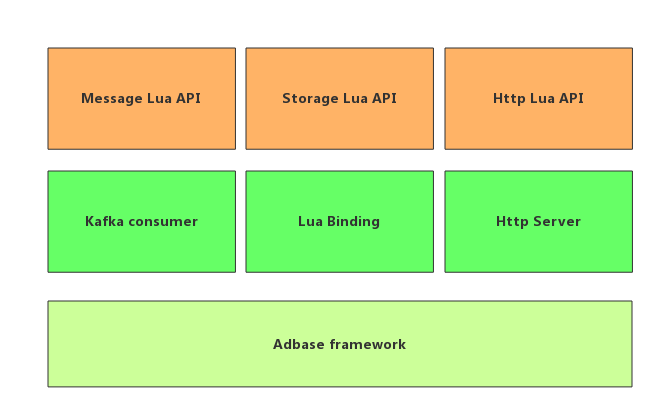

# AIDP (Data Process)

AIDP 负责消息队列消费等一系列逻辑，在获取到消息后具体的处理交由 Lua 脚本处理，开发者可以定制消费队列的处理，并且本框架提供了 Http Server 服务，可以使用 Lua 脚本定制 Http API 接口，再消费消息逻辑和 Http Server 间本框架提供了简单的 Key-Val 存储结构做数据共享。如图是该数据处理框架的结构：



AIDP 处理调用流程：


### Why? 

对于消息队列的大部分应用场景是后端有一个消费模块进行数据处理，将最终的数据存储到一个地方，最终通过 RPC 接口供使用方使用。有的应用场景业务逻辑可能特别的简单，但是大部分语言对于 Kafka 的消费实现都很复杂（Kafka 消费逻辑决定）使得在开发具体业务逻辑的时候增加开发成本，AIDP 通过 C++ 将这一通用开发模型进行抽象封装，为了增加定制性通过嵌入 Lua 脚本语言来完成定制化部分的逻辑。AIDP 是在开发难度、成本与灵活性之间权衡的折中方案。可以满足大量的数据处理需求

### Quick Start

#### RPM 安装

RPM 目前支持 centos7.x 版本，其他版本陆续会上传, 有其他系统版本的需求可以提 issue

#### 编译安装

1. 安装 adbase, 参见：

2. 安装 aidp

```
- git clone git@github.com:weiboad/aidp.git
- cd aidp
- ./cmake.sh
- cd build
- make
- make install
```

#### Example

例如使用 aidp 将 kafka 集群中 topic test 落地到本地，并且统计消息的个数，最终消息个数通过 http api 接口可以获取

在安装好的 aidp 中修改配置 `conf/system.ini` ，配置 kafka 消费调用的 lua 脚本，通过修改 [consumer] -> scriptName 配置配置上 lua 脚本即可, 处理脚本如下：

```
--
--
-- 该脚本实现将 kafka 中的数据落地到文件中，并且统计落地消息数
--
--
local obj = aidp.message.get()
local filename = os.date('%Y-%m-%d-%H') .. '.log'
local files = {};
-- 实例化存储
local storage = aidp.storage()
for k,v in pairs(obj) do
    if #v == 3 then
        if files[v[2]] == nil then
            files[v[2]] = io.open(v[2]..filename, 'a+');
            files[v[2]]:setvbuf('full')
        end
        files[v[2]]:write(v[3]..'\n')
		-- 存储计数
        storage:incr(v[2] .. ':message_size', 1)
    end
end
for k,v in pairs(files) do
    v:flush()
    v:close()
end
```

修改配置文件 [http]->scriptName 设置 http 接口调用的 lua 脚本，lua脚本处理内容如下：

```
-- 获取某个 topic 当前消费的数量
local request = aidp.http.request();
local topic_name = request:get_query('t')
local response = aidp.http.response();
local storage = aidp.storage()
response:set_content(topic_name .. ':message_size ' .. storage:get(topic_name .. ':message_size'));
```

启动 aidp

```
cd /usr/local/adinf/aidp/bin
./aidp -c ../conf/system.ini
```
### Message Consumer 

消息消费模块负责从 Kafka 中获取消息，在获取到消息后会调用 Lua 消费脚本，Lua 脚本中可以调用 `aidp.message.get()` 这个函数获取消息，做相应的处理, 例如：

#### aidp.message.get

Lua 脚本获取 kafka 消息的接口

参数：无

作用范围：仅 Message Consumer 脚本有效

返回：

```
-- 返回多条消息：
-- {
-- 	{
-- 		id, 
-- 		topicName,
-- 		messageBody
-- 	},
-- 	{
-- 		id, 
-- 		topicName,
-- 		messageBody
-- 	},
-- 	{
-- 		id, 
-- 		topicName,
-- 		messageBody
-- 	}
-- }
```

```lua
-- 将 Kafka 消息写入到本地文件中

-- 获取消息
local obj = aidp.message.get()

local filename = os.date('%Y-%m-%d-%H') .. '.log'
local files = {};
local storage = aidp.storage()
for k,v in pairs(obj) do
    if #v == 3 then
        if files[v[2]] == nil then
            files[v[2]] = io.open(v[2]..filename, 'a+');
            files[v[2]]:setvbuf('full')
        end
        files[v[2]]:write(v[3]..'\n')
        storage:incr(v[2] .. ':message_size', 1)
    end
end
for k,v in pairs(files) do
    v:flush()
    v:close()
end

```

### Http Server 

提供 HTTP 接口 Lua 定制开发，对于 Lua 端提供 Request、Response 对象，通过 Request 获取请求数据，并且通过 Lua 脚本处理将最终的响应数据通过 Response 接口定制，Request 和 Response 相关的接口仅仅在 Http Server 处理脚本上有效，对于 Message consumer 处理脚本无效

#### Request

##### aidp.http.request()

实例化 request 对象

##### request:get_uri()

获取请求 URI

##### request:get_remote_address()

获取请求远程的 IP 地址

##### request:get_post_data()

获取 POST 请求的原始数据

##### request:get_post([key])

获取 POST Form-Data 类型的数据

##### request:get_query(key)

获取 GET 数据 

##### request:get_header(key)

获取 Header  数据 

##### request:get_location()

获取 Location  数据 

##### request:get_method()

获取请求类型, 返回枚举 METHOD_GET、METHOD_POST、METHOD_OTHER

#### Response

##### aidp.http.response()

实例化 response 对象

##### response:set_header(key, val)

设置响应 header, 如果存在则覆盖原有的 header

##### response:add_header(key, val)

添加响应 header

##### response:set_content(body)

设置响应 body

##### response:append_content(body)

追加响应 body

##### response:get_code()

获取响应的 HTTP 状态码

##### response:set_body_size(size)

设置 body 体大小

#### Sample

```
local request = aidp.http.request();
local topic_name = request:get_query('t')
local response = aidp.http.response();
local storage = aidp.storage()
response:set_content(topic_name .. ':message_size ' .. storage:get(topic_name .. ':message_size'));
```

### Simple Storage 

存储提供了类似于 Redis 的 key-val 结构的简单的单机存储，辅助实现一些数据缓存存储逻辑

如下 Lua Api 在 Http lua 脚本和 Message Consumer 中通用

##### aidp.storage()

实例化 storage 对象

##### storage:set(key, val, [ttl])

在存储中设置数据, 如果设置 ttl 则到期后该key 会被回收掉，ttl 单位为秒

##### storage:incr(key, step)

对某个值累加 step

##### storage:decr(key, step)

对某个值累减 step

##### storage:get(key)

获取数据

##### storage:exists(key)

判断某个 key 是否存在

##### storage:del(key)

删除某个 key
